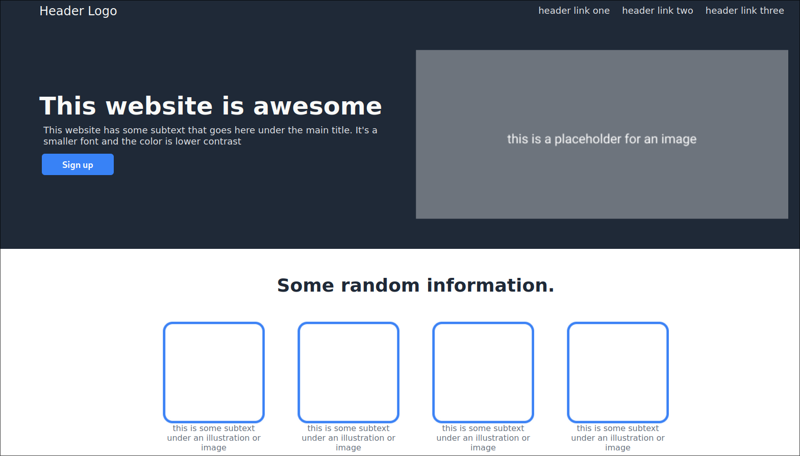

# Landing Page
This is the landing page project from the (amazing) [The Odin Project curriculum](https://www.theodinproject.com/).

It's a basic landing page, made with the requirements from [The Odin Project](https://www.theodinproject.com/lessons/foundations-landing-page)

It features some quotes, images, buttons etc.
It could be usage as a webpage of a simple webpage of a company or a portfolio.

# Skills
### After completing it, I gained:
Basic HTML knowledge (Creating divs, Designing a layout, Using Lists, adding images, Usage of headers and paragraphs)

CSS (Flexbox, Aligning items, changing colors, Positioning Items, using margin and padding etc.)
# Tech
### This project was made with:
[HTML]

[CSS]
# Live Preview
See the page in the [Live Preview](https://pawys.github.io/landing-page/)

